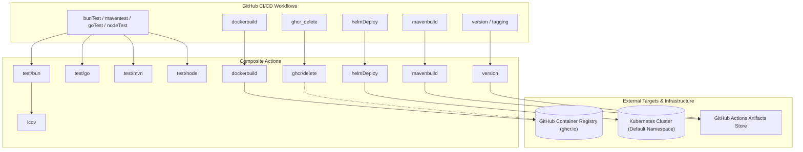

# Architecture & System Design

## 1. Overview
The `DevOps` repository provides modular, composable GitHub Actions and shell scripts designed for continuous integration, artifact distribution, and GitOps-style deployment across containerized and cloud-native workloads.

---

## 2. Component Architecture

---

## 3. Request & Pipeline Lifecycle

### 3.1 Docker Build & Registry Push Flow (`dockerbuild`)
1. **Runner Ingress**: Action receives parameters (`registry`, `image_name`, `dockerfile_path`, credentials).
2. **Authentication**: Docker login performed via `stdin` piping to avoid shell argument leak (`docker login -u ${USERNAME} --password-stdin`).
3. **Tag Calculation**:
   - `main` / `master` -> `release-<YYYYMMDD-HHMM>` (or `release-<run_number>` if `tag_strategy=run_number`).
   - `feature-*` -> `sit-<SHORT_SHA>`.
   - Other branches -> `dev-<SHORT_SHA>`.
4. **BuildKit Build**: Runs `docker build` with `DOCKER_BUILDKIT=1`, `--build-arg BUILDKIT_INLINE_CACHE=1`, and `--cache-from ...:latest`.
5. **Registry Push**: Pushes all tagged variants (`latest` and calculated tag) to target registry.
6. **Credential Cleanup**: Post-action script unconditionally triggers `docker logout` on the registry.

### 3.2 Helm Kubernetes Deployment Flow (`helmDeploy`)
1. **Unshallow Git**: Executes `git fetch --prune --unshallow` to ensure Git history is complete.
2. **GitVersion Evaluation**: Calculates semantic version (`SemVer`) using GitVersion toolset.
3. **Kubeconfig Setup**: Decodes `KUBECONFIG_DATA` from base64, saves to `~/.kube/config`, and locks file permissions (`chmod 600`).
4. **Diff Detection**: Compares `REF_BASE` vs `REF_HEAD` targeting `apps/*.yaml`.
5. **Chart Mutation & Rollout**: Updates `Chart.yaml` version and app name, executing `helm upgrade --install <app> ./chart -f apps/<app>.yaml --atomic --timeout 5m`.

---

## 4. Concurrency & Resource Management
- **Workflow Isolation**: Actions execute in isolated ephemeral GitHub Actions runner virtual environments (Ubuntu latest).
- **Docker BuildKit**: Concurrency handled internally by Docker BuildKit daemon leveraging parallel stage compilation and inline cache layers.
- **Helm Atomic Rollouts**: Upgrades run with `--atomic --timeout 5m` ensuring failed upgrades rollback automatically, preventing cluster state corruption.

---

## 5. Error Handling & Fault Tolerance
- **Strict Shell Mode**: All shell scripts strictly mandate `set -euo pipefail` or `set -eu` to abort on the first unhandled error or unset variable.
- **Fail-Safe Cleanup**:
  - `dockerbuild/action.yaml`: Step `Remove Docker credentials` uses `if: always()`.
  - `ghcr/delete/action.yaml`: Step `Removing login credentials` uses `if: always()`.
- **Abort Function**: Custom `abort()` helper intercepts fatal errors, reporting formatted output to `stderr` and returning exit code 1.

---

## 6. Observability & Telemetry
- **Standard Action Logging**: Rich colored console indicators (`📦 Building image...`, `🔖 Tag yang digunakan:`, `🚀 Push image`, `🔐 Login`).
- **LCOV Code Coverage**: Generates human-readable HTML coverage reports using `genhtml` and executes compiled Bun binary for metrics inspection.
- **Artifact Uploading**: SemVer outputs and Maven binaries are uploaded to GitHub Actions artifacts (`actions/upload-artifact@v4`) for audit trails.
